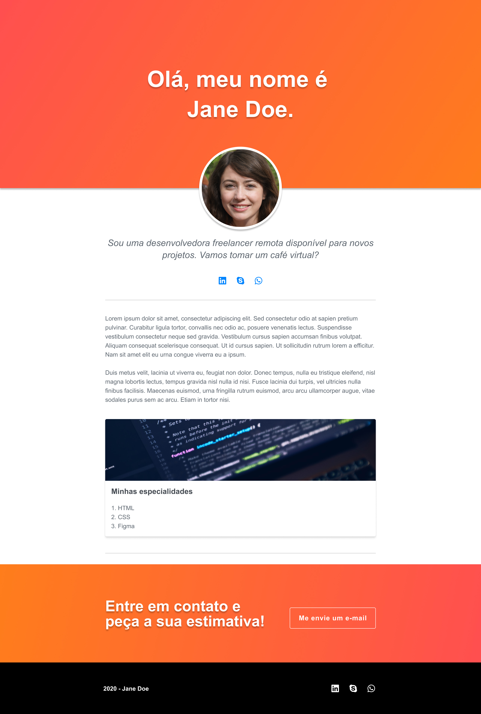

# Webinar Personal Page

layout usado no projeto:

    

> Status do projeto: Concluído &#9989

##<strong>Descrição do projeto</strong> :page_facing_up:

Projeto desenvolvido durante o Webinar da imagine School sobre desenvolvimento web, as sections profile e contact incluindo a parte do main, que finalizavam o projeto, foram desenvolvidas sem auxílio, forma proposta no webinar para consolidar os conhecimentos obtidos.

##<strong>Principais caracteristicas do projeto</strong> :arrow_forward:

:point_right: Foto do usuário;
 
:point_right: Lista de habilidades;
 
:point_right: Botão para contato;
 
:point_right: Links para redes sociais;
 

##<strong>Informações </strong> :speaker:

Site desenvolvido em HTML, CSS;  
Layout do projeto importado do figma;  
Desenvolvido no Visual Studio Code;
